# Making a Pull Request -- Beginners

## Prerequisites

- [Have an understanding of why Github is useful](https://hutchdatascience.org/dasl-snack-github/why-github.html)
- [Have a GitHub account](https://hutchdatascience.org/dasl-snack-github/create-a-github-account.html)
- [Create a repository on Github](https://hutchdatascience.org/dasl-snack-github/setting-up-a-project-on-github.html)

## What's a Pull Request?

If you have repository on GitHub and you're ready to start adding and editing your files!

The GitHub workflow of editing and adding files in your repository is called **pull requests**! Pull requests are a way to set up **proposed changes** (instead of direct changes) before you publish them. Pull requests for you to check and discuss your proposed changes. Importantly, pull requests also allow you to discuss proposed changes with others!

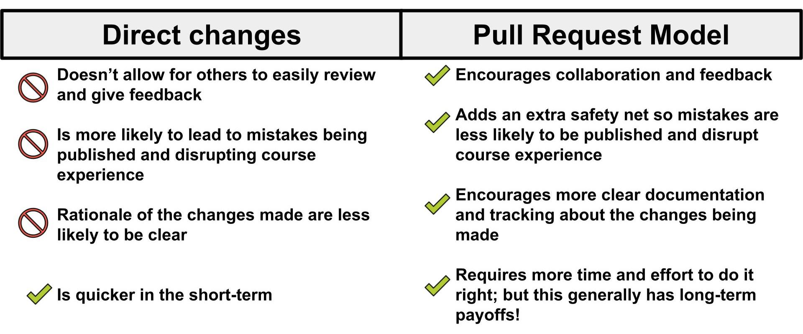

You can edit and add content directly in the GitHub website if you
prefer not to learn how to use git and GitHub from your computer. You can learn how to use git and GitHub in a more [advanced sense in this chapter]().

## Create a new branch

On GitHub code is managed through the use of branches. To explain branches we'll mainly
refer to two branches: your `main` branch:

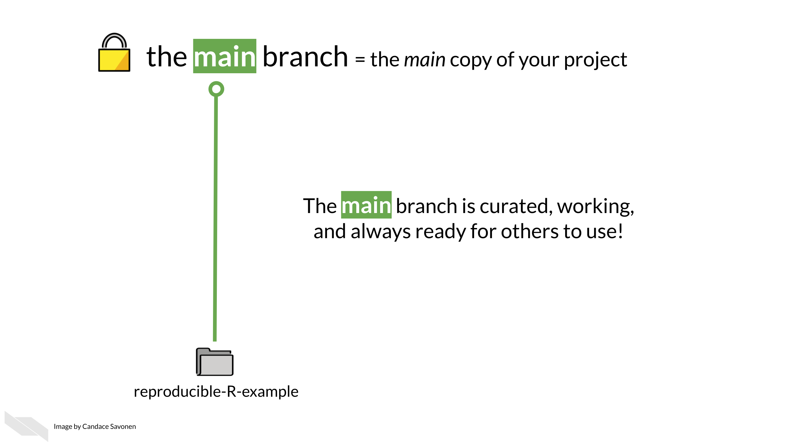

The `main` branch is what your content will be published from and it
will be live to any learners looking at your course. You will want to
keep this `main` branch as preserved and well curated as possible!

So when you are ready to add more content you will want to have an
isolated copy of your files to work from that keeps your main branch
safe as you work. You can name the branch you work from whatever you
like -- its recommended you name it something related to the changes you
are working on

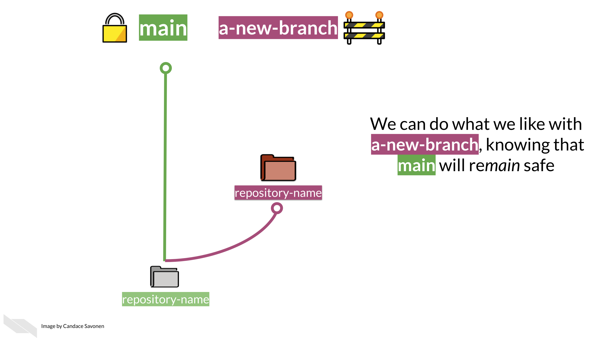

To create a new branch through the GitHub website, you will go to your
main course repository page, click on the branch changing button that
says `main`.

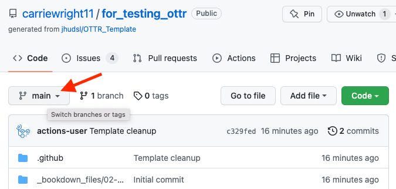

Type in a name for your new branch; something that relates to the
changes you are making. For the purposes of this example, we'll call
this new branch, `a-new-branch`.

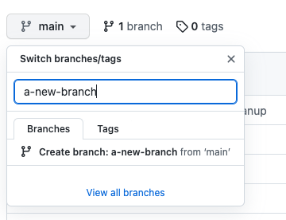

Then click `Create branch: new-changes from main`.

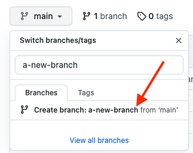

Congrats! You've made a new branch. GitHub will automatically show you
your new branch's files (which have been copied from the `main`).

You can tell that you are on the new branch as the left corner branch
tab now says the name of our new branch (`a-new-branch`).

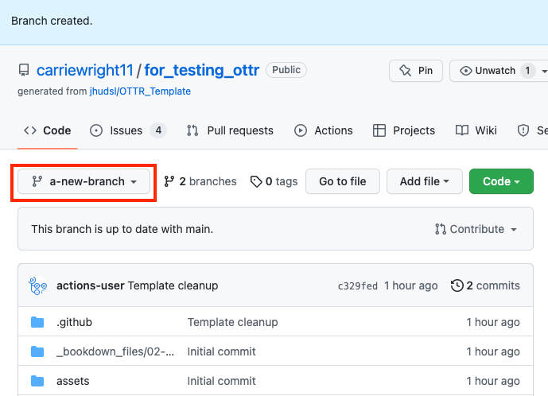

Now that we have a copy of all the files from the `main` branch, we can
safely work on them in the `a-new-branch` branch.

Whenever you are making changes, you'll want to check that you are on
your new branch in order to add any new changes to your pull request,
just look at the left upper corner to make sure!

Now let's try making some changes.

## Committing changes

In your OTTR repository, on your new branch, you can now add/edit/rename
currently existing files while protecting your `main` branch. Adding
changes to a branch is called making `commits`.

We will describe how to edit existing files below, however, GitHub has
great information about how to create and remove files. Additionally
GitHub is always making changes, so if our instruction seem out of date,
definitely checkout what GitHub's current documentation:

-   [Follow GitHub's instructions about managing files through their website here](https://docs.github.com/en/repositories/working-with-files/managing-files)

After every edit you make, scroll down and make sure that you choose
`Commit directly to the new-changes branch.`. This will add your changes
to the pull request.

Then click `Commit changes`. You will need to do this after every change
to add them to your branch.

As an example, we will show how we've made a simple change to a file called
`01-intro.Rmd`.

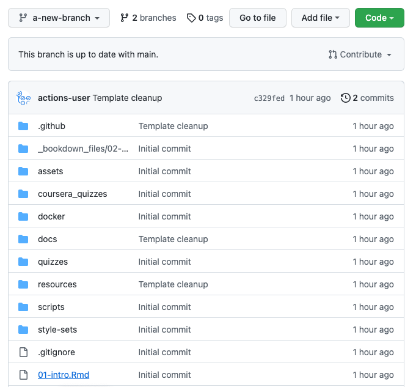

Now click on the edit button to make a change. Notice that it shows what branch we are working on.

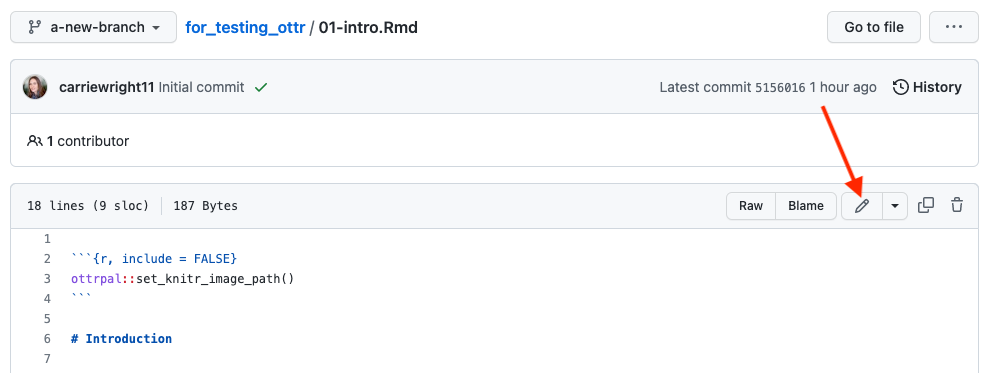

Make an edit, such as adding to the introduction like so.

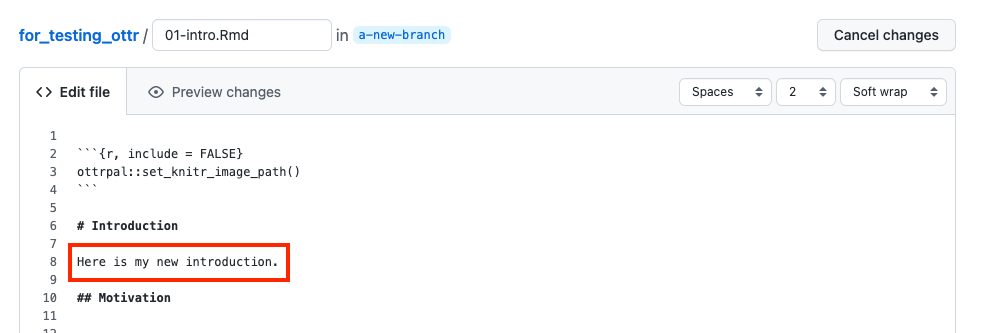

You can preview how it looks by pressing the `Preview changes` button.
Red will indicate new deletions and green will indicate new additions.

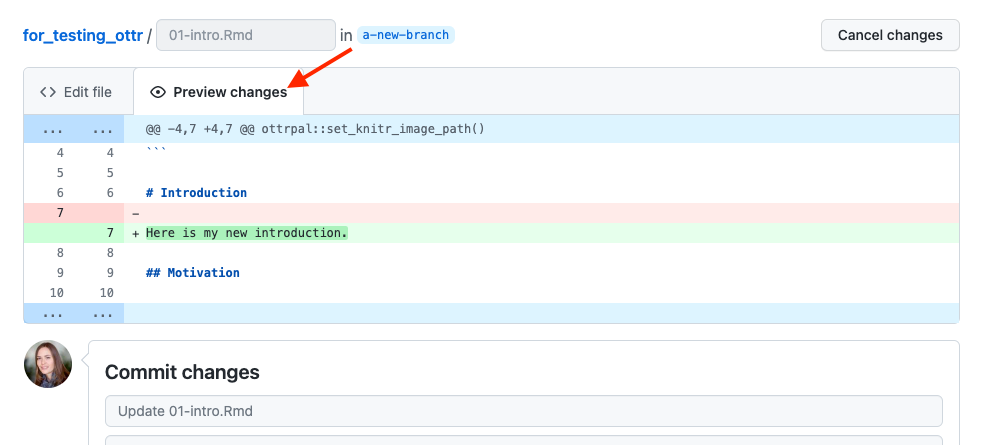

Then write a message about what changes you made and press the
`commit changes` button.

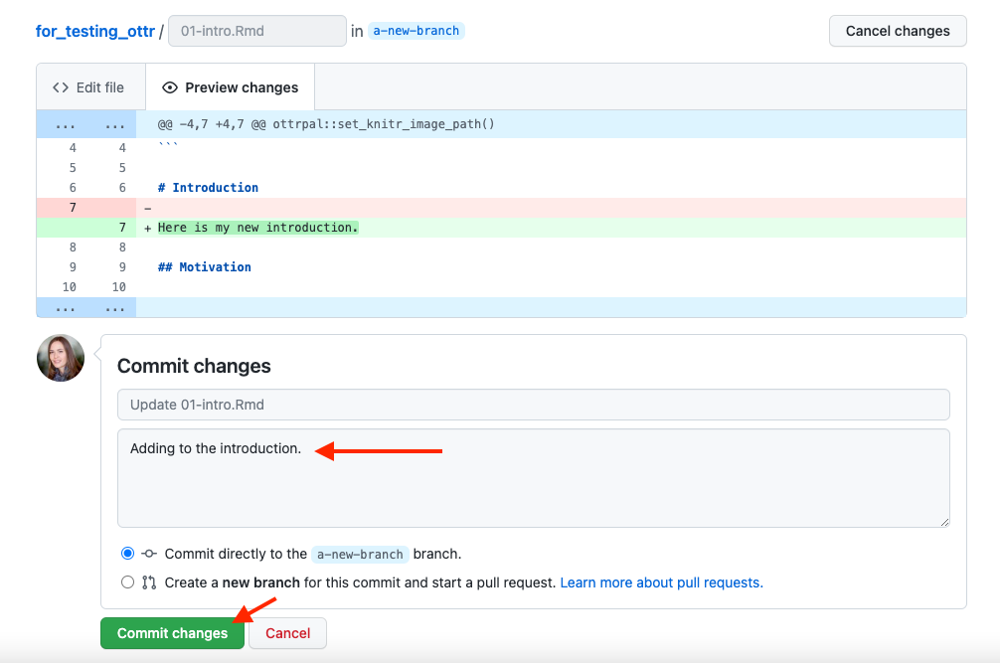

Now you are ready to open your pull request.

## Open a pull request {#open-a-pull-request}

After a variable number of commits, your branch, perhaps called
`a-new-branch` or any other new branch you might have made, is a
different version of the original code base that may have a nifty
improvement to it. But our main goal is to add that nifty improvement to
the `main` branch. To start this process of bringing in new changes to
the main curated repository, we will create a **pull request**.

From GitHub:

> Pull requests let you tell others about changes you've pushed to a
> GitHub repository. Once a pull request is sent, interested parties can
> review the set of changes, discuss potential modifications, and even
> push follow-up commits if necessary.

Pull requests are the meat of how code changes and improvements get
reviewed and incorporated! A vast majority of the benefits of
incorporating GitHub into your workflow centers around fully utilizing
the power of pull requests!

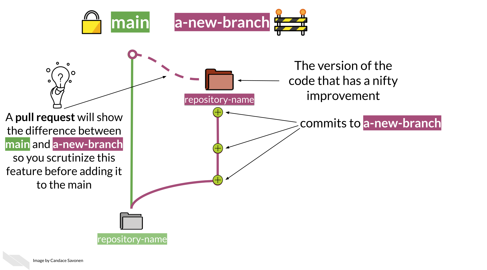

Now we can open up a pull request if we go to our GitHub repository on
GitHub. You might need to migrate back to the main page for your
repository and can do so by simply clicking on the blue name of your
repository at the top. Then you will see something like this yellow
banner message, where there is a button that says
`Compare & pull request`.

If you don't see the pull request message, click
here.

Note that sometimes if you have used the same branch multiple times you
may need some extra steps to create a pull request. This will involve
first clicking on the branch tab (which may have a different number).

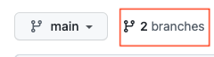

Then click on the `New Pull Request` button for the branch you want to
work on. Be careful that is the branch you intend.

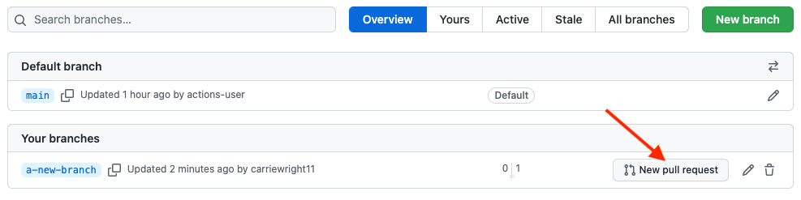

After you click on `Compare & pull request` you'll be taken to a screen
where you can add information about your changes. After you are done
writing your description, click `Create Pull Request`! (If you don't
have your pull request description *perfect* don't worry about it, you
can always edit it later).

Congrats! You've just opened a pull request! For every set of changes
you'll make to your course, you will want to follow this similar set of
steps.

**To summarize, here's what those steps are:**

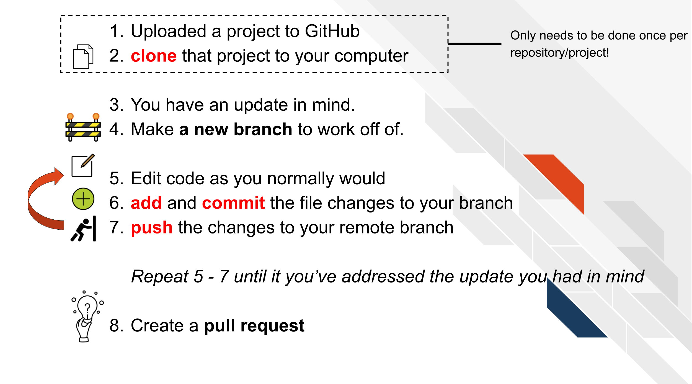

## More resources for learning GitHub

-   [Using version control with GitHub](https://jhudatascience.org/Adv_Reproducibility_in_Cancer_Informatics/using-version-control-with-github.html)
-   [Happy Git and GitHub for the useR](https://happygitwithr.com/)
-   [GitHub for data scientists](https://towardsdatascience.com/introduction-to-github-for-data-scientists-2cf8b9b25fba)
-   [GitHub docs about creating a Pull Request](https://docs.github.com/en/pull-requests/collaborating-with-pull-requests/proposing-changes-to-your-work-with-pull-requests/creating-a-pull-request)
-   [Making a Pull Request](https://www.atlassian.com/git/tutorials/making-a-pull-request)
