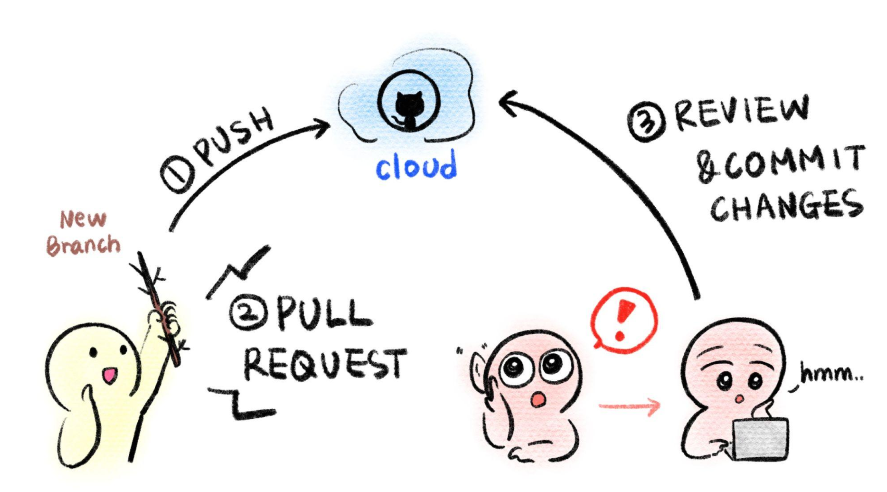

You can edit and add content directly in the GitHub website if you
prefer not to learn Git and GitHub (though we highly recommend it, as
knowing how to use Git/GitHub is a useful skill to integrate into your
workflow -- not just for OTTR).

## Create a new branch

With GitHub in order to keep your OTTR course preserved content and code
is managed through the use of branches. To explain branches we'll mainly
refer to two branches: your `main` branch:


The `main` branch is what your content will be published from and it
will be live to any learners looking at your course. You will want to
keep this `main` branch as preserved and well curated as possible!

So when you are ready to add more content you will want to have an
isolated copy of your files to work from that keeps your main branch
safe as you work. You can name the branch you work from whatever you
like -- its recommended you name it something related to the changes you
are working on


To create a new branch through the GitHub website, you will go to your
main course repository page, click on the branch changing button that
says `main`.


Type in a name for your new branch; something that relates to the
changes you are making. For the purposes of this example, we'll call
this new branch, `a-new-branch`.


Then click `Create branch: new-changes from main`.


Congrats! You've made a new branch. GitHub will automatically show you
your new branch's files (which have been copied from the `main`).

You can tell that you are on the new branch as the left corner branch
tab now says the name of our new branch (`a-new-branch`).


Now that we have a copy of all the files from the `main` branch, we can
safely work on them in the `a-new-branch` branch.


Whenever you are making changes, you'll want to check that you are on
your new branch in order to add any new changes to your pull request,
just look at the left upper corner to make sure!

Now let's try making some changes.

## Committing changes

In your OTTR repository, on your new branch, you can now add/edit/rename
currently existing files while protecting your `main` branch. Adding
changes to a branch is called making `commits`.

We will describe how to edit existing files below, however, GitHub has
great information about how to create and remove files. Additionally
GitHub is always making changes, so if our instruction seem out of date,
definitely checkout what GitHub's current documentation:

-   [Follow GitHub's instructions about managing files through their
    website
    here](https://docs.github.com/en/repositories/working-with-files/managing-files).

After every edit you make, scroll down and make sure that you choose
`Commit directly to the new-changes branch.`. This will add your changes
to the pull request and thus allowing for these changes to be run
through the OTTR checks.

Then click `Commit changes`. You will need to do this after every change
to add them to your branch.

As an example, we will show a simple change to the file called
`01-intro.Rmd`. Scroll down to the this file and click on this file
name.


Now click on the edit button to make a change. Notice that it shows what branch we are working on.


Make an edit, such as adding to the introduction like so.


You can preview how it looks by pressing the `Preview changes` button.
Red will indicate new deletions and green will indicate new additions.


Then write a message about what changes you made and press the
`commit changes` button.


Now you are ready to open your pull request.

# Open a pull request {#open-a-pull-request}

After a variable number of commits, your branch, perhaps called
`a-new-branch` or any other new branch you might have made, is a
different version of the original code base that may have a nifty
improvement to it. But our main goal is to add that nifty improvement to
the `main` branch. To start this process of bringing in new changes to
the main curated repository, we will create a **pull request**.

From GitHub:

> Pull requests let you tell others about changes you've pushed to a
> GitHub repository. Once a pull request is sent, interested parties can
> review the set of changes, discuss potential modifications, and even
> push follow-up commits if necessary.

Pull requests are the meat of how code changes and improvements get
reviewed and incorporated! A vast majority of the benefits of
incorporating GitHub into your workflow centers around fully utilizing
the power of pull requests!


Now we can open up a pull request if we go to our GitHub repository on
GitHub. You might need to migrate back to the main page for your
repository and can do so by simply clicking on the blue name of your
repository at the top. Then you will see something like this yellow
banner message, where there is a button that says
`Compare & pull request`.


<details>

<summary>If you don't see the pull request message, click
here.</summary>

Note that sometimes if you have used the same branch multiple times you
may need some extra steps to create a pull request. This will involve
first clicking on the branch tab (which may have a different number).


Then click on the `New Pull Request` button for the branch you want to
work on. Be careful that is the branch you intend.


</details>

After you click on `Compare & pull request` you'll be taken to a screen
where you can add information about your changes. After you are done
writing your description, click `Create Pull Request`! (If you don't
have your pull request description *perfect* don't worry about it, you
can always edit it later).

Congrats! You've just opened a pull request! For every set of changes
you'll make to your course, you will want to follow this similar set of
steps.

**To summarize, here's what those steps are:**


# Checks on the pull requests

With your pull request open, the series of OTTR GitHub actions checks
will commence! They will print out reports as comments on your pull
request.


Read those comments to begin addressing the problems with more commits
to your branch.

You can adjust what checks are run by editing the
`config_automation.yml` file. This is further discussed in this section
about [the GitHub
Actions](https://github.com/jhudsl/OTTR_Template/wiki/How-to-set-up-and-customize-GitHub-actions-robots).

If you need more information on failed GitHub actions you can scroll to
the bottom of your pull request where the status of the checks are shown
and click on `Details` for more information. If you are unsure what the
error message means and have trouble addressing it, please [file an
issue on the OTTR_Template repository to get
help](https://github.com/jhudsl/OTTR_Template/issues/new?assignees=cansavvy&labels=bug&template=course-template-problem-report.md).

For more on [what to put in a pull request's description, you can read
this
chapter](https://jhudatascience.org/Adv_Reproducibility_in_Cancer_Informatics/engaging-in-code-review---as-an-author.html).

For more on [how to review a pull request, see this
chapter](https://jhudatascience.org/Adv_Reproducibility_in_Cancer_Informatics/engaging-in-code-review---as-a-reviewer.html).


<div class = "notice">
If you encounter situations where a spelling report or URL report doesn't look as expected, you may just need to **refresh the page** or **make another commit** to your pull request.
</div>




# Adding new chapters

Adding new chapters to your OTTR course, requires some specific steps in
addition to what we've discussed here.

### Step 1) Add a new chapter Rmd file

Follow the instructions for adding a new file, but make sure that you
name the file something ending in `.Rmd` and add it to your `new branch`
whatever it is called.

-   For `Entry Level` adding a new file [read
    this](https://docs.github.com/en/repositories/working-with-files/managing-files/adding-a-file-to-a-repository).
-   For `Advanced` adding a new file - you'll create this file locally
    using RStudio or a text editor and follow the steps to add, commit
    and push those to your new branch.

### Step 2) Add the name of your new chapter to your \_bookdown.yml file

As you modify the names of the chapters of your course and add more
chapters (using the `.Rmd` files), you need to update the
`_bookdown.yml` file accordingly.

For example let's say that we added another chapter and named the file
`03-new_chapter_of_course.Rmd`. We would update our `_bookdown.yml` to
look like this:

``` yaml
book_filename: "Course_Name"  
chapter_name: "Chapter "  
repo: https://github.com/jhudsl/OTTR_Template/ ##Make sure you update this for your GitHub Repo!!  
rmd_files: ["index.Rmd",  
            "01-intro.Rmd",   
            "02-chapter_of_course.Rmd",   
            "03-new_chapter_of_course.Rmd",  ##Only this is new!
            "about.Rmd"]  
new_session: yes  
delete_merged_file: true  
language:  
  ui:  
    chapter_name: "Chapter "  
output_dir: "docs"  
```

**Important:** Notice how only one line is different - the one that says
`03-chapter_of_course.Rmd",` Be careful about quotation marks: `""` as
well as commas: `,`!

### Step 3) Commit the \_bookdown.yml file changes to the current branch

Follow the steps for how to commit changes and commit the edits to your
`_bookdown.yml` file to your current branch.

### Step 4) Go to your Pull Request!

Go to your repository and click on the `Pull Request` button in the
navbar. ALl communication about this pull request should happen here


## More resources for learning GitHub

-   [Using version control with
    GitHub](https://jhudatascience.org/Adv_Reproducibility_in_Cancer_Informatics/using-version-control-with-github.html)
-   [Happy Git and GitHub for the useR](https://happygitwithr.com/)
-   [GitHub for data
    scientists](https://towardsdatascience.com/introduction-to-github-for-data-scientists-2cf8b9b25fba)
-   [Intro to
    GitHub](https://lab.github.com/githubtraining/introduction-to-github)
-   [First Day on
    GitHub](https://lab.github.com/githubtraining/first-day-on-github)
-   [First Week on
    GitHub](https://lab.github.com/githubtraining/first-week-on-github)
-   [GitHub docs about creating a Pull
    Request](https://docs.github.com/en/pull-requests/collaborating-with-pull-requests/proposing-changes-to-your-work-with-pull-requests/creating-a-pull-request)
-   [Making a Pull
    Request](https://www.atlassian.com/git/tutorials/making-a-pull-request)
