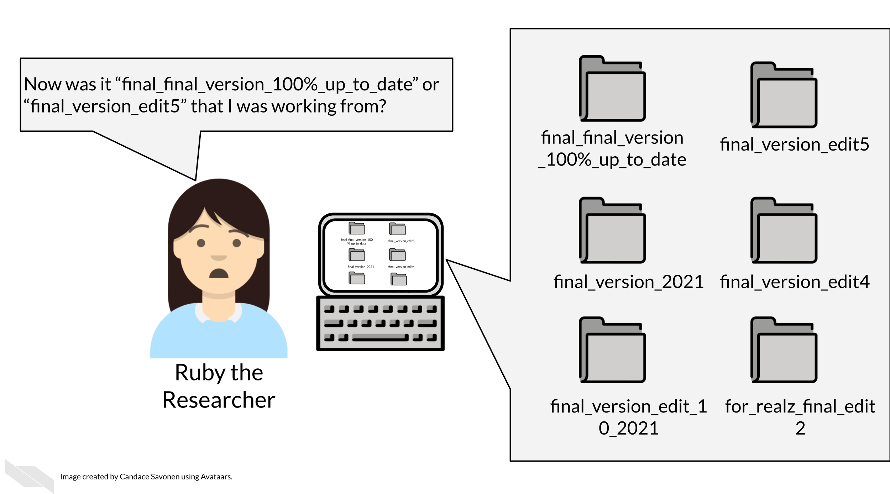
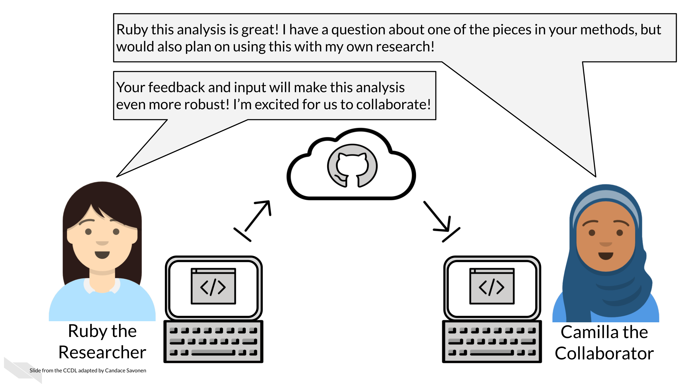
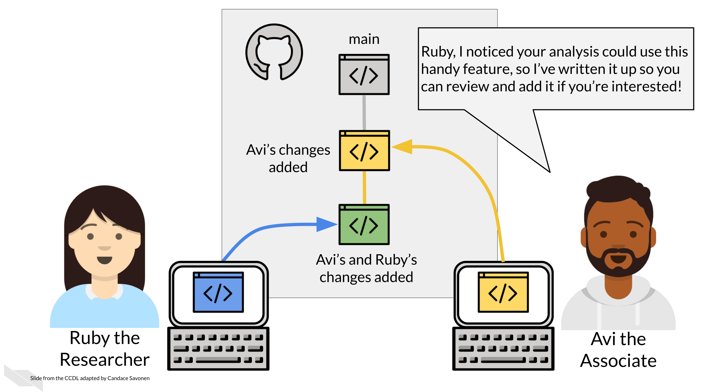

# Why GitHub

git is a version control system that is a great tool for creating reproducible analyses.
What is version control? Ruby here is experiencing a lack of version control and could probably benefit from using git.  

All of us at one point or another have created different versions of a file or document, but for analysis projects this can easily get out of hand if you don't have a system in place. That's where git comes in handy.

There are other version control systems as well, but git is the most popular in part because it works with GitHub, an online hosting service for git controlled files.

### GitHub and git allow you to...

#### Maintain transparent analyses

Open and transparent analyses are a critical part to conducting open science. GitHub allows you to conduct your analyses in an open source manner. Open science also allows others to better understand your methods and potentially borrow them for their own research, saving everyone time!

#### Have backups of your code and analyses at every point

Life happens, sometimes you misplace a file or your computer malfunctions. If you ever lose data on your computer or need to retrieve something from an earlier version of your code, GitHub allows you to revert your losses.

#### Keep a documented history of your project

Overtime in a project, a lot happens, especially when it comes to exploring and handling data. Sometimes the rationale behind decisions that were made around an analysis can get lost. GitHub keeps communications and tracks the changes to your files so that you don't have to revisit a question you already answered.

#### Collaborate with others

Analysis projects highly benefit from good collaborations! But having multiple copies of code on multiple collaborators' computers can be a nightmare to keep straight. GitHub allows people to work on the same set of code concurrently but still have a method to integrate all the edits together in a systematic way.  

#### Experiment with your analysis

Data science projects often lead to side analyses that could be very worth while but might be scary to venture on if you don't have your code well version controlled. Git and GitHub allow you to venture on these side experiments without fear since your main code can be kept safe from your side venture.

